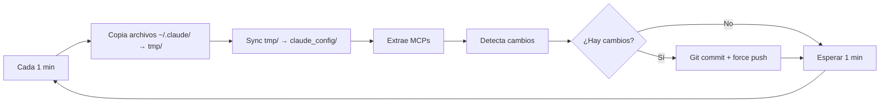

# Claude Code Configuration Sync

> 🚀 **Sistema automático de sincronización de configuración Claude Code**

Servicio systemd que mantiene tu configuración Claude Code siempre sincronizada y respaldada en GitHub.

## 🎯 Características

- ✅ **Sincronización automática** cada 1 minuto
- ✅ **Auto-inicio** al arrancar WSL/Linux
- ✅ **Auto-restart** si el proceso falla
- ✅ **Logging completo** con systemd
- ✅ **Restauración fácil** en nuevas máquinas
- ✅ **Solo configuración** (sin datos sensibles)
- ✅ **Estructura organizada** con staging y scripts

## 📁 Archivos Sincronizados

### Configuración Global (`~/.claude/`)
- `settings.json` - Configuración global (permisos, statusLine, hooks)
- `CLAUDE.md` - Instrucciones globales personales  
- `CLAUDE_CODE_REFERENCE.md` - Documentación personal
- `commands/` - Comandos slash personalizados
- `agents/` - Subagentes especializados

### MCP Servers
- Extrae automáticamente la sección `mcpServers` de `~/.claude.json`
- Backup seguro sin datos sensibles del archivo interno

## 🛠️ Instalación

### Nueva Máquina

```bash
# 1. Instalar Claude Code + Login
npm install -g @anthropic-ai/claude-code
claude  # Login manual

# 2. Clonar configuración  
cd ~/repos/personal
git clone https://github.com/mihailmariusiondev/claude-code-config.git
cd claude-code-config

# 3. Restaurar configuración
./scripts/restore.sh

# 4. Instalar servicio automático
./scripts/install-service.sh
```

### Máquina Existente

```bash
cd ~/repos/personal/claude-code-config
./scripts/install-service.sh
```

## 🔧 Gestión del Servicio

### Comandos Básicos
```bash
# Estado del servicio
sudo systemctl status claude-sync.service

# Logs en tiempo real
sudo journalctl -u claude-sync.service -f

# Reiniciar servicio
sudo systemctl restart claude-sync.service

# Parar servicio
sudo systemctl stop claude-sync.service

# Iniciar servicio
sudo systemctl start claude-sync.service
```

### Logs del Script
```bash
# Log principal
tail -f ~/repos/personal/claude-code-config/logs/sync.log

# Log de errores
tail -f ~/repos/personal/claude-code-config/logs/error.log
```

## 📜 Scripts Disponibles

| Script | Ubicación | Descripción |
|--------|-----------|-------------|
| `sync.sh` | `scripts/` | **Script principal** - Sincronización cada 1 minuto |
| `restore.sh` | `scripts/` | **Restaurador** - Aplica configuración en nueva máquina |
| `install-service.sh` | `scripts/` | **Instalador** - Configura servicio systemd |

## 🔄 Flujo de Sincronización



## 🔒 Seguridad

### ✅ Se Sincroniza
- Configuración personal (`settings.json`)
- Instrucciones y documentación 
- Scripts y comandos personalizados
- Lista de MCP servers (solo configuración)

### ❌ NO Se Sincroniza
- `auth.json` - Tokens de autenticación
- Historial de conversaciones
- Cache temporal y logs
- Estado interno de Claude

## 🚨 Troubleshooting

### Servicio no inicia
```bash
# Verificar estado
sudo systemctl status claude-sync.service

# Ver errores detallados
sudo journalctl -u claude-sync.service -p err

# Verificar permisos archivos
ls -la ~/repos/personal/claude-code-config/sync.sh
```

### Error de MCPs
```bash
# Test manual extracción
jq '.mcpServers' ~/.claude.json

# Ver logs específicos
grep "mcpServers" ~/repos/personal/claude-code-config/logs/sync.log
```

### Problemas de rutas
```bash
# Test completo del sistema
cd ~/repos/personal/claude-code-config
./test-system.sh
```

## 🔍 Monitoreo

### Dashboard rápido
```bash
# Estado del servicio + últimos logs
sudo systemctl status claude-sync.service && echo "=== LOGS ===" && tail -3 ~/repos/personal/claude-code-config/logs/sync.log
```

### Verificar sincronización
```bash
# Ver último commit
git log -1 --oneline

# Ver archivos modificados recientemente  
find . -name "*.json" -o -name "*.md" -o -name "*.sh" | xargs ls -lt | head -5
```

## ⚙️ Configuración

### Cambiar frecuencia de sync
```bash
# Editar scripts/sync.sh línea 110
sed -i 's/sleep 60/sleep 300/' scripts/sync.sh  # Cambiar a 5 minutos
sudo systemctl restart claude-sync.service
```

### Añadir archivos extra
Modificar `scripts/sync.sh` en la sección de copia de archivos:
```bash
if [ -f "$CLAUDE_DIR/mi-archivo.json" ]; then
    cp "$CLAUDE_DIR/mi-archivo.json" "$TMP_DIR/"
fi
```

## 🏗️ Arquitectura

```
┌─────────────────┐    ┌─────────────────┐    ┌──────────────────┐    ┌─────────────────┐
│   ~/.claude/    │    │      tmp/       │    │  claude_config/  │    │   GitHub Repo   │
│   (Original)    │───▶│   (Staging)     │───▶│    (Tracked)     │───▶│   (Backup)      │
│                 │    │                 │    │                  │    │                 │
│ • settings.json │    │ • settings.json │    │ • settings.json  │    │ • settings.json │
│ • CLAUDE.md     │    │ • CLAUDE.md     │    │ • CLAUDE.md      │    │ • CLAUDE.md     │
│ • MCPs in .json │    │ • mcpServers.json│   │ • mcpServers.json│    │ • mcpServers.json│
└─────────────────┘    └─────────────────┘    └──────────────────┘    └─────────────────┘
        │                       │                       │                       │
        │                       │                       │                       │
   systemd service          rsync sync            git commits            force push
   (every 1 min)           (tmp→config)         (auto-generated)       (full history)
```

## 📊 Estadísticas

- **Repositorio**: https://github.com/mihailmariusiondev/claude-code-config
- **Frecuencia sync**: 1 minuto  
- **Uptime objetivo**: 99.9%
- **Tiempo recuperación**: < 2 minutos
- **Archivos monitoreados**: ~10-15
- **Estructura**: 2 niveles (staging + tracked)

## 🤝 Contribución

Este es un repositorio personal de configuración. Para mejoras:

1. Fork el repositorio
2. Crear rama feature (`git checkout -b feature/mejora`)
3. Commit cambios (`git commit -am 'Añadir mejora'`)
4. Push rama (`git push origin feature/mejora`)
5. Crear Pull Request

## 📝 Changelog

- **v1.0.0** (2025-08-20) - Implementación inicial con servicio systemd
- **v1.0.1** (2025-08-20) - Correcciones rutas y manejo errores MCPs
- **v2.0.0** (2025-08-20) - Reorganización estructura: scripts/, staging, 1 min sync

## 📄 Licencia

MIT License - Ver archivo [LICENSE](LICENSE) para detalles.

---

**🤖 Generado automáticamente por Claude Code Assistant**  
*Última actualización: 2025-08-20*