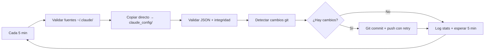

# Claude Code Configuration Sync

> 🚀 **Sistema automático de sincronización de configuración Claude Code con logging exhaustivo**

Servicio systemd de calidad producción que mantiene tu configuración Claude Code siempre sincronizada y respaldada en GitHub.

## 🎯 Características v3.0

- ✅ **Calidad producción** - Error handling completo, validaciones exhaustivas
- ✅ **Sincronización automática** cada 5 minutos
- ✅ **Rutas 100% dinámicas** - Funciona en cualquier máquina/usuario
- ✅ **Logging completo** - Cada operación logged con detalles  
- ✅ **Auto-inicio** al arrancar WSL/Linux
- ✅ **Auto-restart** si el proceso falla
- ✅ **Restauración inteligente** en nuevas máquinas
- ✅ **Merge inteligente** - Solo reemplaza sección mcpServers
- ✅ **Backups automáticos** con timestamps
- ✅ **Validación JSON** antes de cada operación
- ✅ **Integridad verificada** - Sizes, checksums, file counts
- ✅ **Estadísticas en tiempo real** - Memory, disk, performance
- ✅ **Sin archivos temporales** - Copia directa, sin staging

## 📁 Archivos Sincronizados

### Configuración Global (`~/.claude/`)
- `settings.json` - Configuración global (permisos, statusLine, hooks)
- `CLAUDE.md` - Instrucciones globales personales  
- `CLAUDE_CODE_REFERENCE.md` - Documentación personal
- `commands/` - Comandos slash personalizados
- `agents/` - Subagentes especializados

### MCP Servers (Merge Inteligente)
- `.claude.json` - Archivo completo como backup
- **Restore inteligente**: Solo reemplaza `mcpServers` en archivo existente
- **Preserva**: Historial, tokens, estado interno del usuario

## 🛠️ Instalación

### Nueva Máquina
```bash
# 1. Instalar Claude Code + Login
npm install -g @anthropic-ai/claude-code
claude  # Login manual

# 2. Clonar configuración  
cd ~/repos/personal  # (o cualquier directorio)
git clone https://github.com/mihailmariusiondev/claude-code-config.git
cd claude-code-config

# 3. Restaurar configuración (con logging completo)
./scripts/restore.sh

# 4. Instalar servicio automático (con validaciones)
./scripts/install-service.sh
```

### Máquina Existente
```bash
cd ~/repos/personal/claude-code-config  # (o donde tengas el repo)
./scripts/install-service.sh
```

## 🔧 Gestión del Servicio

### Comandos Básicos
```bash
# Estado del servicio
sudo systemctl status claude-sync.service

# Logs en tiempo real (systemd)
sudo journalctl -u claude-sync.service -f

# Logs de los scripts (detallados)
tail -f logs/sync.log           # Sincronización
tail -f logs/install-service.log  # Instalación  
tail -f logs/restore.log        # Restauración

# Reiniciar servicio
sudo systemctl restart claude-sync.service

# Parar/Iniciar servicio
sudo systemctl stop claude-sync.service
sudo systemctl start claude-sync.service
```

### Logs Detallados por Script
```bash
# Sync (operación principal)
cat logs/sync.log | grep ERROR          # Solo errores
cat logs/sync.log | grep "CYCLE #"      # Estadísticas de ciclos
cat logs/sync.log | grep "HOURLY"       # Stats cada hora

# Instalación (troubleshooting)
cat logs/install-service.log | tail -20

# Restauración (nueva máquina) 
cat logs/restore.log | grep "SUCCESS"   # Todo lo restaurado
```

## 📜 Scripts v3.0 (Calidad Producción)

| Script | Líneas | Descripción | Logging |
|--------|--------|-------------|---------|
| `sync.sh` | 220+ | **Sincronización continua** - Enterprise grade | Exhaustivo: ciclos, sizes, performance, system stats |
| `restore.sh` | 400+ | **Restauración inteligente** - Merge mcpServers | Detallado: cada archivo, integridad, backups |
| `install-service.sh` | 300+ | **Instalador robusto** - Validaciones systemd | Completo: cada comando, permisos, verification |

### Características Técnicas v3.0
- **Strict mode**: `set -euo pipefail` en todos los scripts
- **Error handling**: Cada comando validado con logging detallado
- **Validaciones**: JSON, permisos, sizes, integridad verificada
- **Rutas dinámicas**: Auto-detecta usuario, repo, paths
- **Backups automáticos**: Timestamps, rollback automático en errores
- **Performance monitoring**: Memory, disk, runtime stats cada hora

## 🔄 Flujo de Sincronización v3.0



**Cambios v3.0:**
- ❌ **Sin tmp/** - Eliminado directorio temporal
- ✅ **Copia directa** - ~/.claude/ → claude_config/
- ✅ **Validación previa** - JSON válido antes de copiar
- ✅ **Compare inteligente** - Skip si archivos idénticos
- ✅ **Push con retry** - Normal → force push como fallback

## 🔒 Seguridad

### ✅ Se Sincroniza
- Configuración personal (`settings.json`)
- Instrucciones y documentación 
- Scripts y comandos personalizados
- **Archivo `.claude.json` completo** (como backup)

### ❌ NO Se Sincroniza  
- `auth.json` - Tokens de autenticación
- Historial de conversaciones (preserved en restore)
- Cache temporal y logs
- Estado interno personal (preserved en restore)

### 🛡️ Merge Inteligente
- **Backup automático** con timestamp antes de restore
- **Solo reemplaza** sección `mcpServers` durante restore  
- **Preserva todo** lo demás del archivo interno
- **Rollback automático** si el merge falla

## 🚨 Troubleshooting v3.0

### Servicio no inicia
```bash
# Estado detallado
sudo systemctl status claude-sync.service

# Logs de instalación (si acabas de instalar)
cat logs/install-service.log | grep ERROR

# Ver errores systemd
sudo journalctl -u claude-sync.service -p err

# Verificar permisos scripts
ls -la scripts/
```

### Errores de sincronización
```bash
# Log principal detallado
cat logs/sync.log | tail -50

# Errores específicos
grep ERROR logs/sync.log | tail -10

# Validación JSON manual
python3 -c "import json; json.load(open('$HOME/.claude.json')); print('Valid JSON')"

# Test conectividad
ping -c 1 github.com
```

### Problemas de restore
```bash
# Log completo de restauración
cat logs/restore.log | grep -E "(ERROR|SUCCESS|INFO)"

# Verificar merge inteligente
cat logs/restore.log | grep "mcpServers"

# Verificar backups creados
ls -la ~/.claude.json.backup* 2>/dev/null || echo "No backups found"
```

## 🔍 Monitoreo v3.0

### Dashboard completo
```bash
# Estado + estadísticas recientes
sudo systemctl status claude-sync.service
echo "=== RECENT STATS ==="
grep "HOURLY STATS" logs/sync.log | tail -2
echo "=== LATEST CYCLE ==="
grep "CYCLE #" logs/sync.log | tail -1
```

### Estadísticas avanzadas
```bash
# Performance metrics
grep -E "(Memory|Disk|Load)" logs/sync.log | tail -5

# Últimos archivos procesados
grep "Copied.*bytes" logs/sync.log | tail -10

# Errores recientes
grep ERROR logs/*.log | tail -5
```

### Verificar sincronización
```bash
# Ver último commit con detalles
git log -1 --stat

# Archivos modificados recientemente  
find claude_config/ -name "*.json" -o -name "*.md" | xargs ls -lt | head -5

# Size del log (rotación automática > 1MB)
ls -lh logs/sync.log
```

## ⚙️ Configuración

### Cambiar frecuencia de sync
```bash
# Editar sync.sh (buscar sleep 300)
sed -i 's/sleep 300/sleep 600/' scripts/sync.sh  # 10 minutos
# o para 1 minuto:
sed -i 's/sleep 300/sleep 60/' scripts/sync.sh   # 1 minuto

# Reiniciar servicio para aplicar
sudo systemctl restart claude-sync.service
```

### Añadir archivos personalizados
Modificar `scripts/sync.sh` en las funciones `copy_file`:
```bash
# Añadir después de línea ~90
copy_file "$CLAUDE_DIR/mi-config-personal.json" "$CONFIG_DIR/mi-config-personal.json" "mi-config-personal.json"
```

## 🏗️ Arquitectura v3.0

```
┌─────────────────┐         ┌──────────────────┐    ┌─────────────────┐
│   ~/.claude/    │  Direct │  claude_config/  │    │   GitHub Repo   │
│   (Original)    │────────▶│    (Tracked)     │───▶│   (Backup)      │
│                 │  Copy   │                  │    │                 │
│ • settings.json │         │ • settings.json  │    │ • settings.json │
│ • CLAUDE.md     │         │ • CLAUDE.md      │    │ • CLAUDE.md     │
│ • ~/.claude.json│         │ • .claude.json   │    │ • .claude.json  │
│ • commands/     │         │ • commands/      │    │ • commands/     │
│ • agents/       │         │ • agents/        │    │ • agents/       │
└─────────────────┘         └──────────────────┘    └─────────────────┘
        │                           │                       │
        │                           │                       │
   ✅ Never touched            git commits            auto force push
   directly by sync        (every 5 min if           (with retry)
   (only reads)             changes detected)        
                                   │
                              ┌─────────┐
                              │ logs/   │
                              │ • sync  │
                              │ • install│  
                              │ • restore│
                              └─────────┘
```

**Cambios arquitectónicos v3.0:**
- ❌ **Eliminado tmp/staging** - Simplificación radical
- ✅ **Copia directa validada** - Con integridad verificada  
- ✅ **Logging separado** - Un log file por script
- ✅ **Backups inteligentes** - Solo cuando es necesario

## 📊 Estadísticas v3.0

- **Repositorio**: https://github.com/mihailmariusiondev/claude-code-config
- **Frecuencia sync**: 5 minutos (configurable)
- **Calidad**: Producción enterprise con logging exhaustivo
- **Uptime objetivo**: 99.9% con auto-restart
- **Tiempo recuperación**: < 1 minuto (nueva máquina: < 5 minutos)
- **Archivos monitoreados**: ~10-15 (dinámico)
- **Logging**: 3 archivos separados con rotación automática
- **Portabilidad**: 100% - Funciona en cualquier máquina Linux/WSL

## 🤝 Contribución

Este es un repositorio personal de configuración. Para mejoras:

1. Fork el repositorio
2. Crear rama feature (`git checkout -b feature/mejora`)
3. Commit cambios (`git commit -am 'Añadir mejora'`)
4. Push rama (`git push origin feature/mejora`)
5. Crear Pull Request

## 📝 Changelog

- **v1.0.0** (2025-08-20) - Implementación inicial con servicio systemd
- **v1.0.1** (2025-08-20) - Correcciones rutas y manejo errores MCPs
- **v2.0.0** (2025-08-20) - Reorganización: scripts/, staging, 5 min sync
- **v2.1.0** (2025-08-20) - Arreglado flujo staging, reemplazado jq por python3
- **v3.0.0** (2025-08-21) - 🚀 **MAJOR UPGRADE**: 
  - ✅ Calidad producción enterprise
  - ✅ Logging exhaustivo (3 archivos separados)  
  - ✅ Rutas 100% dinámicas
  - ✅ Eliminado tmp/ - Copia directa validada
  - ✅ Error handling completo
  - ✅ Restore con merge inteligente mcpServers
  - ✅ Backups automáticos con rollback
  - ✅ Performance monitoring
  - ✅ 600+ líneas código robusto total

## 📄 Licencia

MIT License - Ver archivo [LICENSE](LICENSE) para detalles.

---

**🤖 Generado automáticamente por Claude Code Assistant**  
*Última actualización: 2025-08-21 - Version 3.0.0 Enterprise*